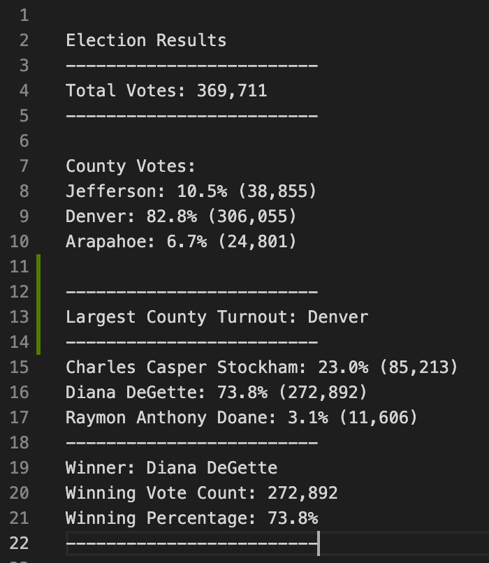
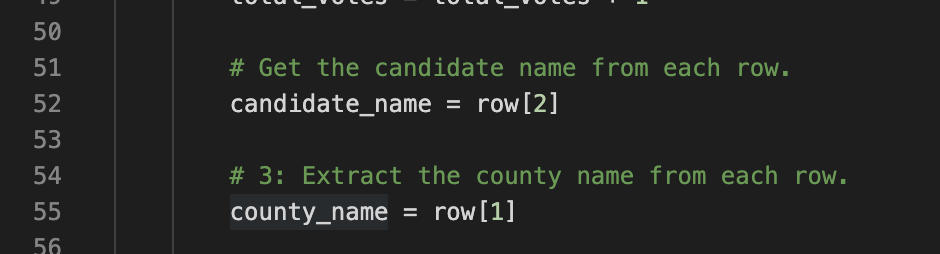

# An analysis of election audit in a precinct with 3 counties

## Overview of Election Audit

The purpose of this analysis is to use python to determine the winner candidate and the county with the highest turnout in the election. The vote counts for each candidate and county were also shown in the result.

## Election-Audit Results

- There were 369711 votes cast in the election
- County Votes Summary:
  - Jefferson: 10.5% (38,855)
  - Denver: 82.8% (306,055)
  - Arapahoe: 6.7% (24,801)
- Denver had the largest number of votes
- Candidate Votes Summary:
  - Charles Casper Stockham: 23.0% (85,213)
  - Diana DeGette: 73.8% (272,892)
  - Raymon Anthony Doane: 3.1% (11,606)
- Diana Degettes won the election, she has 272892 votes and had 74.8% of the total votes.

the output for the analysis was shown below

## Election-Audit Summary
1. We can modify the script for line 52 and 55

Instead of type the column number directly to get the candidate name and county name, we can use the header row to determine the column numebr. Even if the order of the column change in other election, the script can still adapt the change and get the value from the right column.

2. 
